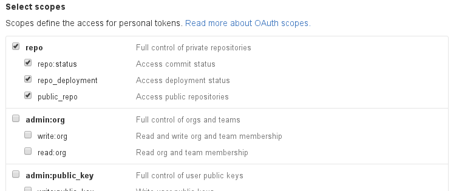

# ngd-git-backup

## Summary

A tool to automate backup process of an organisations github repositories to local disk.

## Requirements

A valid personal token with the correct permissions is needed to list an organisations repositories. For more details see the following link: [https://help.github.com/articles/creating-an-access-token-for-command-line-use/](https://help.github.com/articles/creating-an-access-token-for-command-line-use/)

The permissions should be set up with full repo access in order to allow the cloning of public and provate repositories. See below screen shot:



## How To Use

### Running by hand

The command requires three placement conditional variables to run. This also takes an optional 4th argument where you can specify the number of projects in your organisation. This should only be used if your organisation has more than 200 projects.

```
./ngd-git-backup.sh ORGANISATION TOKEN WORK_DIR
```

If your organisation has more than 200 projects:

```
./ngd-git-backup.sh ORGANISATION TOKEN WORK_DIR PROJECT_LIMIT
```

The script takes 4 arguments.

| Argument      | Example            | Description                        | Notes             |
|---------------|--------------------|------------------------------------|-------------------|
| ORGANISATION  | ngineered          | your organisation name             |                   |
| TOKEN         | GHJKR678YfrktyREYE | your personal access token         |                   |
| WORK_DIR      | /home/backup       | directory for your backups         | no trailing slash |
| PROJECT_LIMIT | 201                | number of projects in organisation | optional          |

### Cron

Ideally you should cron this command to keep your repo's up to date.

```
# ┌───────────── min (0 - 59)
# │ ┌────────────── hour (0 - 23)
# │ │ ┌─────────────── day of month (1 - 31)
# │ │ │ ┌──────────────── month (1 - 12)
# │ │ │ │ ┌───────────────── day of week (0 - 6) (0 to 6 are Sunday to
# │ │ │ │ │                  Saturday, or use names; 7 is also Sunday)
# │ │ │ │ │
# │ │ │ │ │
# * * * * *  command to execute
```
The following example backups up hourly:
```
0 * * * * user /path_to_script/ngd-git-backup.sh ORGANISATION TOKEN WORK_DIR
```
